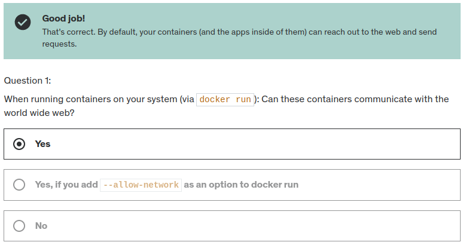
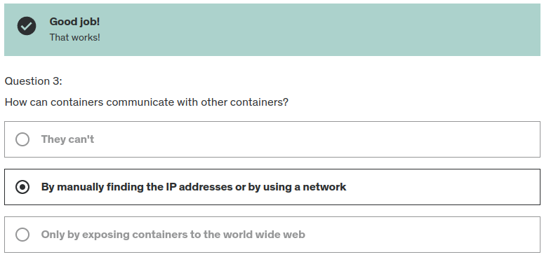

sending a request from inside the container to the outside (World Wide Web) just works fine out of the box without any special settings

- create a new Network
  - ```Bash
    docker network create db-network
    ```
- Communicating with Other Containers
  - ```Bash
    # Create the 1st Container
    docker run -network my-network --name cont1 my-image
    
    # Create the 2nd Container
    docker run -network my-network --name cont2 my-other-image
    ```

### Docker Network Drivers

Docker Networks actually support different kinds of "**Drivers**" which influence the behavior of the Network.

The default driver is the "**bridge**" driver - it provides the behavior shown in this module (i.e. Containers can find each other by name if they are in the same Network).

The driver can be set when a Network is created, simply by adding the `--driver` option.

```Bash
docker network create --driver bridge my-net
```
_Of course, if you want to use the "bridge" driver, you can simply omit the entire option since "bridge" is the default anyways._

Docker also supports these alternative drivers - though you will use the "bridge" driver in most cases:

- **host**: For standalone containers, isolation between container and host system is removed (i.e. they share localhost as a network)
- **overlay**: Multiple Docker daemons (i.e. Docker running on different machines) are able to connect with each other. Only works in "Swarm" mode which is a dated / almost deprecated way of connecting multiple containers
- **macvlan**: You can set a custom MAC address to a container - this address can then be used for communication with that container
- **none**: All networking is disabled.
- **Third-party plugins**: You can install third-party plugins which then may add all kinds of behaviors and functionalities

As mentioned, the "bridge" driver makes most sense in the vast majority of scenarios.


<details>

   <summary><h3> The Quiz </h3></summary>

- 
- 
- 
- 

</details>