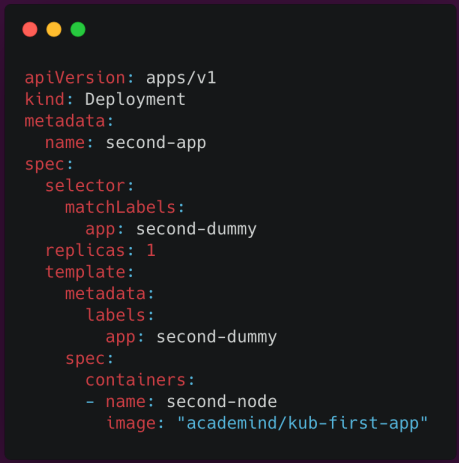

### 12 - Kubernetes in Action - Diving into the Core Concepts


- build the image

```Bash
docker build -t kub-1-app-img .
```

- create a deployment object (imperative approach)

```Bash
# retag the img #
docker tag kub-1-app-img mmsaeed509/kub-1-app-img

# push the img to registry #
docker push mmsaeed509/kub-1-app-img 

kubectl create deployment first-app --image=mmsaeed509/kub-1-app-img
```

- create a new service object to Exposes Pods to the Cluster or Externally(imperative approach)
    - e.g: to open the app(website) via browser
    - `--type`
        - `--type=ClusterIP` is the default type which basically means it will **only**  be reachable inside the cluster
        - `--type=NodePort` means this deployment should be exposes with help off the IP address of the worker node on which it's running, distant actually would be accessible from outside.
        - `--type=LoadBalancer` utilizes a LoadBalancer which has to exist in the infrastructure on which our cluster runs, this LoadBalancer will generate a unique address for this service and distribute incoming traffic across all pods.
            - > **_NOTE:_** it's only available if your cluster and infrastructure supports it.


```Bash
$ kubectl expose deployment first-app --type=LoadBalancer --port=8080
service/first-app exposed

# list all services
$ kubectl get services
NAME         TYPE           CLUSTER-IP     EXTERNAL-IP   PORT(S)          AGE
first-app    LoadBalancer   10.98.223.29   <pending>     8080:31204/TCP   53s
kubernetes   ClusterIP      10.96.0.1      <none>        443/TCP          3d15h

# to access the app
$ minikube service first-app
|-----------|-----------|-------------|---------------------------|
| NAMESPACE |   NAME    | TARGET PORT |            URL            |
|-----------|-----------|-------------|---------------------------|
| default   | first-app |        8080 | http://192.168.49.2:31204 |
|-----------|-----------|-------------|---------------------------|
🎉  Opening service default/first-app in default browser...
```
- Scaling
  - a **Replica** is simply an instance of a pod/container.
  - `5` **Replica** means that the same pod/container is running 3 times

```Bash
kubectl scale deployment/first-app --replicas=5 
```

- update deployments (e.g the image is updated)
  - `kubectl set image <deployment_name> <container_name>=<new_image_name>`
  - `kubectl set image deployment/first-app kub-1-app-img=mmsaeed509/kub-1-app-img`

```Bash
kubectl set image deployment/first-app kub-1-app-img=mmsaeed509/kub-1-app-img

# roll out the deployment #
kubectl rollout status deployment/first-app

# rollback #
kubectl rollout undo deployment/first-app

# rollout history #
kubectl rollout history deployment/first-app

# rollout history for a specific rollout #
kubectl rollout history deployment/first-app --revision=1

# rollback for a specific rollout #
kubectl rollout undo deployment/first-app --to-revision=1
```
- clean 

```Bash
kubectl delete services first-app
kubectl delete deployments.apps first-app
```

___

### Imperative Approach Vs The Declarative Approach



- instead of writing these commands manually.
- we will write our services and deployment config into a file.
- and apply this file to our cluster.
- here we will use a **_YAML_** file.
  - e.g :
    - `deployment.yaml`
    - `service.yaml`

- command `kubectl apply -f config.yaml`

this Approach is like docker compose.

<br/>

- test

```Bash
kubectl apply -f deployment.yaml
kubectl apply -f service.yaml
```

- visit website

```Bash
$ minikube service backend

|-----------|---------|-------------|---------------------------|
| NAMESPACE |  NAME   | TARGET PORT |            URL            |
|-----------|---------|-------------|---------------------------|
| default   | backend |          80 | http://192.168.49.2:31414 |
|-----------|---------|-------------|---------------------------|
🎉  Opening service default/backend in default browser...
```

- Updating & Deleting Resources

```Bash
# update deployment/services #
kubectl apply -f deployment.yaml
kubectl apply -f service.yaml
# OR
kubectl apply -f deployment.yaml,service.yaml
# OR
kubectl apply -f deployment.yaml -f service.yaml
# OR
kubectl apply -f=deployment.yaml,service.yaml
# OR
kubectl apply -f=deployment.yaml -f=service.yaml

# delete deployment/services #
kubectl delete -f deployment.yaml
kubectl delete -f service.yaml
# OR
kubectl delete -f deployment.yaml,service.yaml
# OR
kubectl delete -f=deployment.yaml,service.yaml
# OR
kubectl delete -f deployment.yaml -f service.yaml
# OR
kubectl delete -f=deployment.yaml -f=service.yaml
```

___

### in Multiple config file add `---` as a separator

```yaml
apiVersion: v1
kind: Service
metadata:
  name: backend
  # rest of config

---

apiVersion: apps/v1
kind: Deployment
metadata:
# rest of config
```

- test

```Bash
kubectl apply -f master-deployment.yaml

minikube service backend

kubectl delete -f master-deployment.yaml
```
