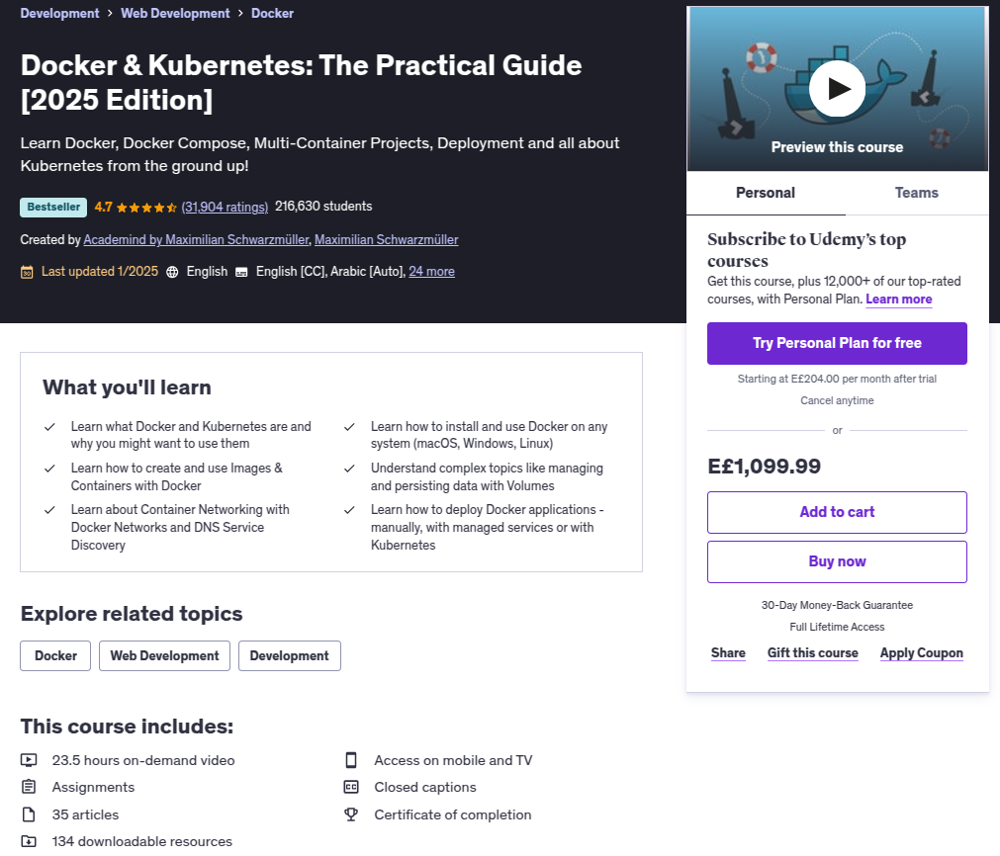
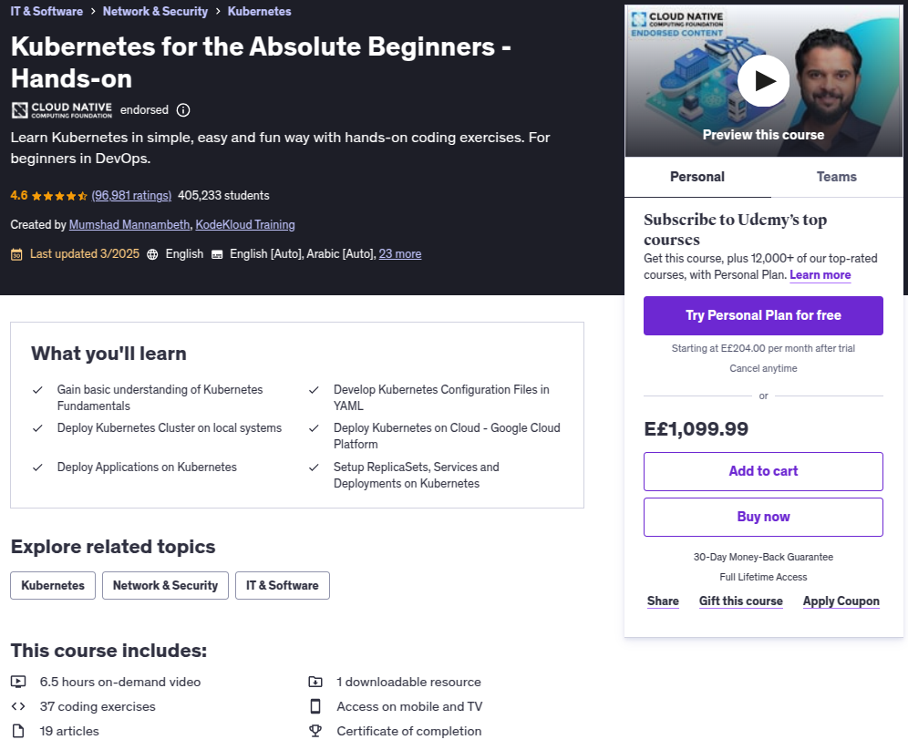
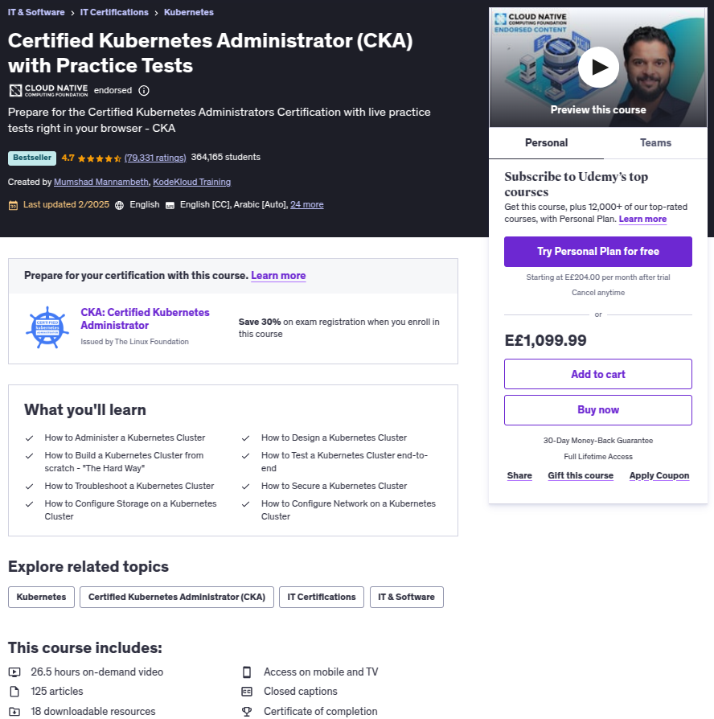
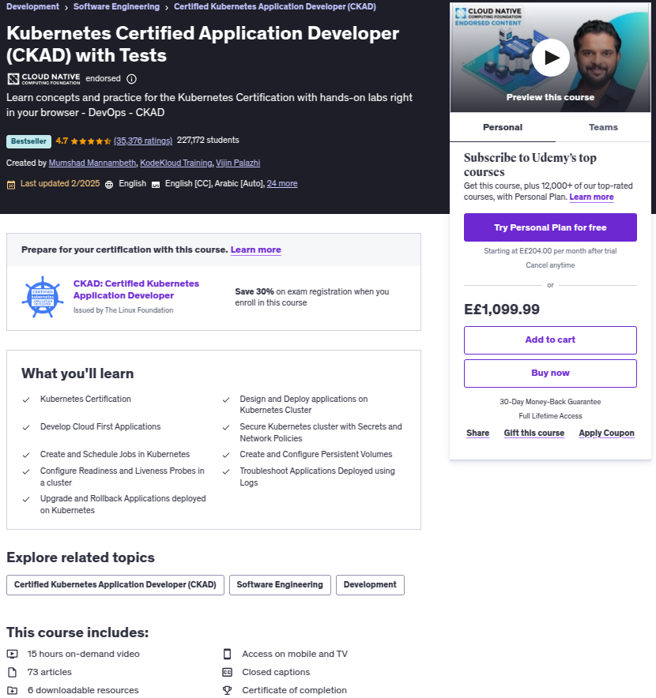

# Docker & Kubernetes

Learn Docker, Docker Compose, Multi-Container Projects, Deployment and all about Kubernetes from the ground up!

| [Docker & Kubernetes: The Practical Guide](https://www.udemy.com/course/docker-kubernetes-the-practical-guide) | [Kubernetes for the Absolute Beginners - Hands-on](https://www.udemy.com/course/learn-kubernetes) | [Certified Kubernetes Administrator (CKA) with Practice Tests](https://www.udemy.com/course/certified-kubernetes-administrator-with-practice-tests) | [Kubernetes Certified Application Developer (CKAD) with Tests](https://www.udemy.com/course/certified-kubernetes-application-developer) |
|----------------------------------------------------------------------------------------------------------------|---------------------------------------------------------------------------------------------------|-----------------------------------------------------------------------------------------------------------------------------------------------------|-----------------------------------------------------------------------------------------------------------------------------------------|
|                                                                               |                                                              |                                                                                                                                  |                                                                                                                     |
